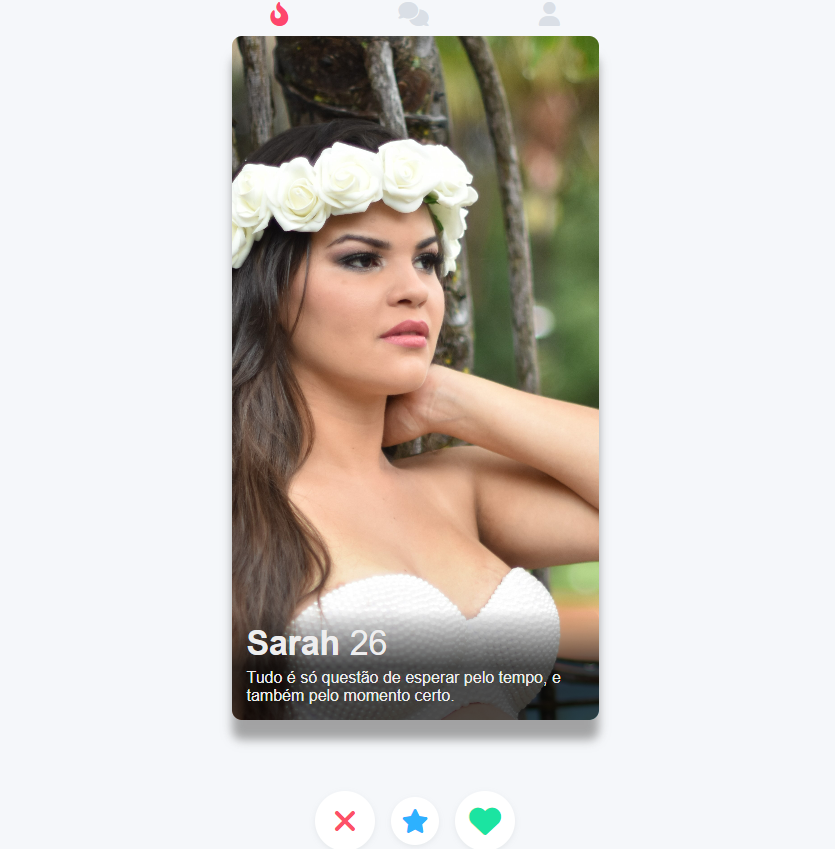

# Bem-vindo ao projeto guiado do Clone do Tinder (Front-End)!

Neste projeto, tive a oportunidade de aprender e aplicar conceitos essenciais de desenvolvimento web, enquanto cria um clone do Tinder, um popular aplicativo de encontros. O objetivo principal é desenvolver habilidades práticas na construção de interfaces de usuário atraentes e responsivas, utilizando tecnologias como HTML, CSS e JavaScript.

# Benefícios do projeto:

1. Aprendizado prático de conceitos de front-end.

2. Desenvolvimento de habilidades em HTML, CSS e JavaScript.

3. Experiência na construção de interfaces de usuário atraentes e responsivas.

Este projeto guiado é uma excelente oportunidade para praticar minhas habilidades de front-end e desenvolver um projeto realista e relevante para o mercado. Através dessa experiência, você consolidará seus conhecimentos e estará preparado para enfrentar desafios futuros no desenvolvimento web.
